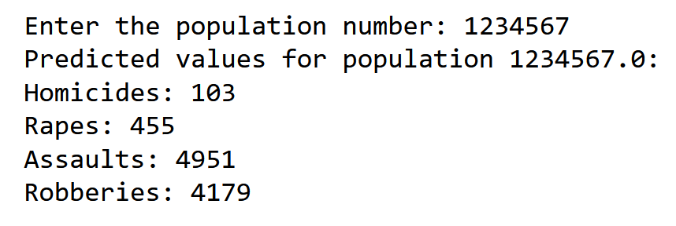

# COMP3125 Individual Project
## Introduction

&emsp;The exploration and analysis of crime helps us understand and address societal problems; this project uses data 
science to provide further insight as to the possible patterns in crime. The focal point includes analyzing the 
very city we live in along with analyzing many popular cities spanning the US.

&emsp;My objective is to use these patterns in crime to ultimately predict crime and crime rates in the future. 
Hopefully, this objective will help understand the possible crime and threats of the future and allow police
reinforcements to identify these predicted crime rates and plan accordingly.

[Main Method](https://github.com/yeek1ATWIT/COMP3125_Project/blob/main/codes/Main.ipynb)

The study should answer the following questions:
1. What would be the Annual Crime Rate for Boston MA for the Next 10 Years?
2. What Crime would Likely Occur given a City and Time?
3. What is the Distribution of Crime given the population number?
   
## Selection of Data

The model processing and training are conducted using a Jupyter Notebook.

&emsp;The dataset is called [Crime in Context](https://www.kaggle.com/datasets/marshallproject/crime-rates)[1]. 
This dataset contains over 40 years (up to 2015) of homicide, rape, robbery and assault crimes across 68 police jurisdictions 
with populations of 250,000 or greater. The dataset contains additional yet unused features
such as months reported, crimes per capita, homicides per capita, rapes per capita, assaults per capita,
robberies per capita. This dataset resources directly from FBI reports and uses the 2014 reported estimates to
predict the numbers of its final year, 2015.

Data Preview:

&emsp;This dataset was modified to exclude any illegal values including blank and NAN values. Other means of modification
weren't used on this dataset including pipelines. Pipelines wasn't used to fuse datasets because there wasn't more
than one dataset used in this project; the current dataset not only managed to answer all the prompts by itself-
(thus not requiring the use of another dataset), but the dataset ultimately lacked a dataset similar ENOUGH to be 
combined with.

## Methods

Tools:
- NumPy: A library used for numerical operations. It additionally handles specially formatted
  arrays, matrices and other mathmatical functions.
- Pandas: A library which offers data structures, manipulation and analysis.
- Difflib (Difference Library): A library used for comparing strings.
- Scikit-learn: A machine learning library which provides analysis and modeling. It includes
  resources like classification, regression and clustering.
- Github: A website allowing for code tracking, sharing and collaboration.
- Jupyter: An interactive Python enviroment.

Inference methods used with Scikit:
- Support Vector Regression (SVR): A complex type of Support Vector Machine (SVM) used for
  finding the best hyperplane with given data.
- Linear Regression: An algorithm which predicts a regression line and assumes a linear
  relationship between the given data.

Inference methods used with difflib:
- get_close_matches: A function which finds the closest matches of a string to a database of
  strings.

Radial Basis Function (RBF) Kernel used with Scikits's SVR: 
&emsp;RBF transforms input data into a higher plane/dimension before developing a regression line. 
It's a technique effectively used when the relationship within the data isn't linear.

Usages:
- NumPy: NumPy was used to handle and manipulate arrays. For example, NumPys were used to
  create the arrays for reporting the predicted crime rate.
- Pandas: Pandas was used to handle and manipulate data; datasets had been modified to
  filter out missing, invalid, or NA values. This was crucial for organizing and cleaning
  the dataset.
- Difflib: Only used to extract suggesting options of any user's queries. For example, If
  a user misspelled a valid city relevant to the dataset, the user would use Difflib to find
  which city/cities that the user meant to type.
- Scikit-learn: Handled the machine learning models which helped calculate and predict most
  queries from the user.
- Scikit-learn.preprocessing: standardized features by removing means and scaling to unit
  variance.
- GridSearchCV: Used for hyperparameter tuning of all SVR algorithms. It exhaustively finds
  the best parameters from a list/grid of parameters that achieves the highest accuracy.

Usage of Linear Regression: 
  &emsp;Linear regression was used to linearly model the relationship between the report year and
  the number of violent crimes in Boston, MA. The model is trained using the historical data
  of boston's violent crimes according to the dataset. Once trained, it was used to predict 
  violent crimes from 2023-2032.
  - Used 'fit' to train the model given data
  - Used 'predict' to extract a predicted output from the model

Efficency of Linear Regression: 
  &emsp;Linear regression was used because it efficently understood the decreasing-slope
  relationship associated with years as the x-axis and violent crimes as the y-axis. Other
  models failed to capture this relationship or failed to capture it efficently.

Assumptions/Limitations with Linear Regression:
- It assumes that the relationships between features of the dataset are linear.
- The developed regression line is sensitive to outliers; the regression assumes that there's
  no outliers in the dataset for Years v. Boston's Violent crimes.
- Due to the downward slope of the regression line, the model assumes that an annual negative violent
  crime rate can be met with enough time. This is impossible because there's no such thing.

Modules Used for Linear Regression:
- Linear Regression class for Sklearn.linear_model

Usage of Support Vector Regression (SVR): 
  &emsp;SVR is used to predict the order of different types of crimes bases on city/state, and it's also used
  to predict the annual rates for each type of violent crime based on a given population number and year.
  Seperate models were not only used for each problem, but for each crime type; Each model instance would
  be assigned and trained with a specific crime type.
  - Used 'fit' to train the model given data
  - Used 'predict' to extract a predicted output from the model
  - Used Kernel 'rbf'
  - Used C
  - Used Gamma

Efficency of Support Vector Regression (SVR): 
  &emsp;SVR captures more complex relationships between features in datasets- usually unachievable with just
  linear relationships. It's used to pursue high means of accuracy with this complex data without 
  significantly compromising speed and memory.

Assumptions/Limitations with Support Vector Regression (SVR):
  - Needs to use a given kernel hyperparameters C and Gamma.
  - SVR is significantly sensitive to these parameters; adjusting these parameters affects its accuracy.

Modules Used for Support Vector Regression (SVR):
- SVR class from sklearn.svm

## Results
### What would be the Annual Crime Rate for Boston MA for the Next 10 Years?

### What Crime would Likely Occur given a City and Time?
The following figure shows the results where the given city and time is Boston, MA and 2024.

### What is the Distribution of Crime given the population number?
The following figure shows the results for a given population number 1234567.

## Coding Discussion
&emsp;I was struggling to choose my prompts and datasets; most datasets found were hard to apply, and 
coming up with prompts related to crime were difficult. I managed to deduce my datasets down to 2 
before refining my prompts. However, after refining my prompts, I soon realized that the second dataset 
became irrelevant and unnecessary. 
  &emsp;I managed to code most aspects of the project seemlessly. Implementating fine-tuning for the algorithms were 
by far the hardest part. There needed to be a balance between runtime and fine-tuning for the users- and my
code additionally needed to minimize code redundancy. At times my code didn't work properly; some variables 
weren't initialized, or some variables were carried through multiple tests without 'refreshing' between 
each test. These bugs also stemmed during the conversion from basic algorithms to fine-tuned algorithms.

## Results Discussion
&emsp;The study conducted mostly targeted Boston, MA. Some questions could either be refined or customized depending
on the user's wants; the study was developed and coded with the novelty of customization in mind. For the results
concerning Boston MA, it seems that Boston is becoming a safer neightborhood for overall annual violent crime rates.
If accurate, the study predicts that Boston will still have a substantial amount of crime for 2024- still predicting
an annual rate of hundreds of rapes and thousands of robberies and assaults. This aligns with other various studies
and articles where crime rate is still somewhat substantial, but certainly decreasing.
  &emsp;The study also finds and confirms that there's a correlation between the US's population size and crime rate where
a higher population would increase the crime rate. This makes sense because 'more people = more oppurtunities for a
crime to occur.' The study not only confirms this statistic, but it also poses as a representation towards an average
crime rate for specific population numbers. If a user wanted to find the average crime rates given Boston's population
number, they could use the average predicted results and compare it to Boston's current crime rate. 
  &emsp;The study could certainly be improved in accuracy overall. The algorithms used in the study could use better and 
more refined fine-tuning, and all fine-tuning calculations should be recorded to a document so that the same 
calculations don't need to be ran multiple times. The algorithms kernels should I also likely be changed and refined; 
the algorithms shouldn't likely use linear regression. The datasets could also be more thorough. The datasets should
include data up to our current year (2023) instead of being up to 2015. Multiple datasets should also be used. The
data should be extracted from an 'average' of these datasets.

## References
[1] [Crime in Context, 1975-2015](https://www.kaggle.com/datasets/marshallproject/crime-rates)

## Unused Dataset 
[2] [US Crime Dataset](https://www.kaggle.com/datasets/khanboss/us-crime-dataset)
  
